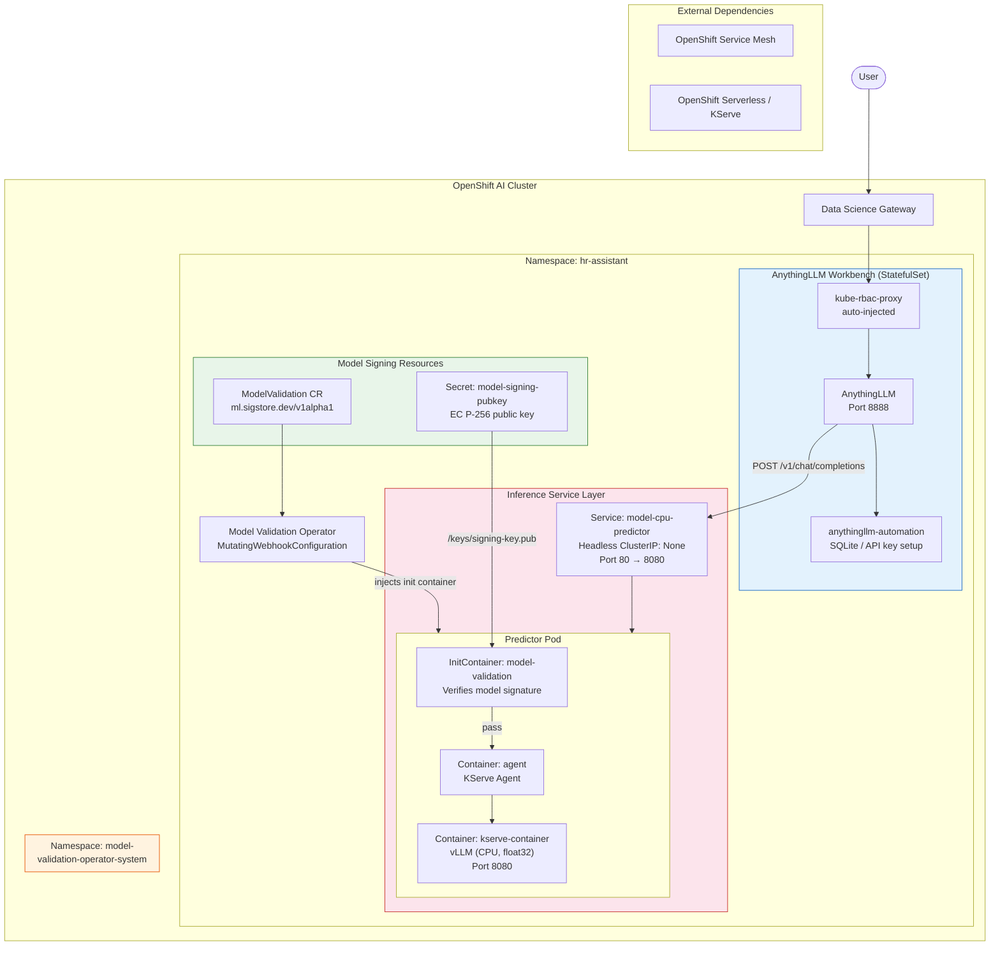
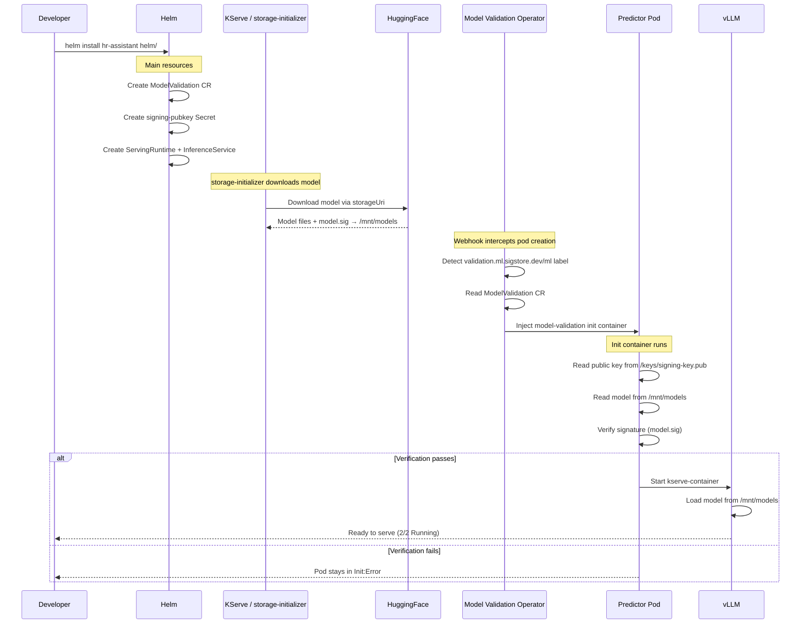
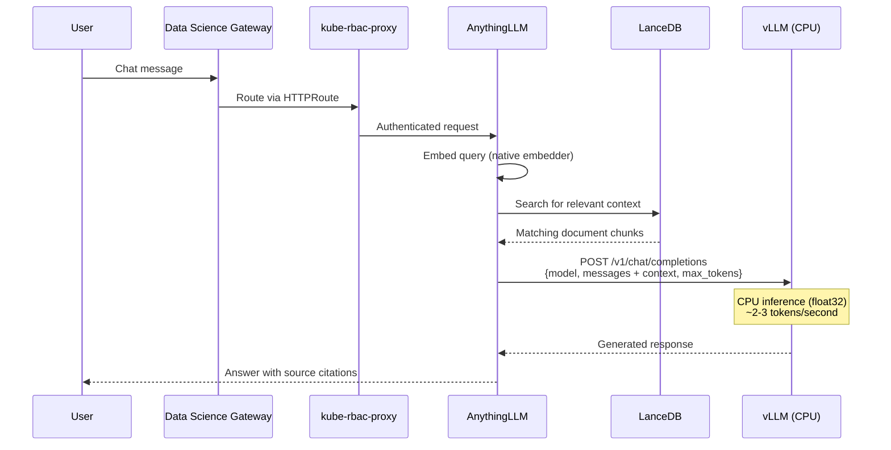
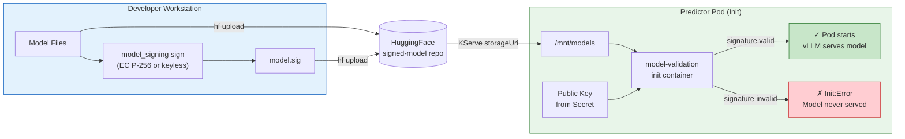

# Architecture

This document describes the detailed component architecture of the HR Assistant deployment.
All resource names containing a model identifier (shown as `<model.name>` below) are derived
from the `model.name` field in [`helm/values.yaml`](helm/values.yaml).

## High-Level Overview

## Deployment Flow

## Request Flow

## Model Signing and Verification

## Component Details

### AnythingLLM Workbench

| Property | Value |
|---|---|
| Type | StatefulSet (Pod: `anythingllm-0`) |
| Containers | `kube-rbac-proxy` (auto-injected), `anythingllm`, `anythingllm-automation` |
| Port | 8888 (AnythingLLM), 8443 (RBAC proxy) |
| Features | Chat UI, RAG, document embedding (native), LanceDB vector store |
| LLM Provider | `generic-openai` → `http://<model.name>-cpu-predictor:8080/v1` |
| Volumes | PVC `anythingllm`, CA bundle ConfigMap, auto-created TLS Secret |

### Predictor Pod

| Property | Value |
|---|---|
| Type | Deployment via KServe InferenceService (RawDeployment mode) |
| Init Container | `model-validation` — injected by Model Validation Operator |
| Containers | `agent` (KServe Agent), `kserve-container` (vLLM) |
| Port | 8080 (HTTP) |
| Model source | `/mnt/models` (downloaded via KServe storageUri, cryptographically verified) |
| vLLM config | `--dtype float32`, `VLLM_CPU_DISABLE_AVX512=1`, `ONEDNN_VERBOSE=0` |
| API endpoints | `GET /health`, `GET /v1/models`, `POST /v1/chat/completions`, `POST /v1/completions` |
| Resources | Requests: 2 CPU / 4Gi — Limits: 8 CPU / 8Gi |

### Model Validation Operator

| Property | Value |
|---|---|
| Namespace | `model-validation-operator-system` |
| Scope | Cluster-scoped (MutatingWebhookConfiguration) |
| Trigger | Pods with label `validation.ml.sigstore.dev/ml` |
| CRD | `ModelValidation` (`ml.sigstore.dev/v1alpha1`) |
| Action | Injects `model-validation` init container with verification agent |
| On pass | Init container exits 0, pod proceeds to start main containers |
| On fail | Init container exits non-zero, pod stays in `Init:Error` |

### Helm-Managed Resources

| Resource | Purpose |
|---|---|
| `ModelValidation/<name>-validation` | Configures signature verification |
| `Secret/model-signing-pubkey` | PEM-encoded public key for verification |
| `InferenceService/<name>-cpu` | KServe predictor with validation label |
| `ServingRuntime/vllm-cpu` | vLLM container spec |
| `Secret/<name>-vllm-cpu` | AnythingLLM LLM provider config |
| `Secret/anythingllm-api` | API key for AnythingLLM |
| `ServiceAccount/anythingllm` | Identity for AnythingLLM pod |
| `Job/anythingllm-seed` | Pre-seeds workspace with documents |

### Auto-Created by OpenShift AI Controller

| Resource | Purpose |
|---|---|
| `Service/anythingllm` | Port 80→8888 (main workbench) |
| `Service/anythingllm-kube-rbac-proxy` | Port 8443 (auth proxy) |
| `HTTPRoute/nb-hr-assistant-anythingllm` | Routes traffic from Data Science Gateway |
| `ReferenceGrant/notebook-httproute-access` | Cross-namespace access |
| `ConfigMap/anythingllm-kube-rbac-proxy-config` | RBAC proxy configuration |
| `Secret/anythingllm-kube-rbac-proxy-tls` | TLS certificates |

## Performance Characteristics

Performance varies depending on the model configured in `helm/values.yaml`. Below are
general guidelines for CPU inference with the default resource limits (8 CPU, 8Gi memory):

- **Inference Speed:** ~20-40 seconds for 50-100 tokens on 8 CPU cores
- **Throughput:** ~2-3 tokens/second on CPU
- **First response:** May take 30-60 seconds as the model processes context
- **Max Context:** Configured via `model.maxModelLen` in `values.yaml` (default: 2048 tokens)
- **Concurrency:** Supports multiple requests (CPU KV cache managed by vLLM)

Smaller models (135M-360M parameters) will be faster; larger models (1B+) will produce
higher quality responses but require more resources and time.
